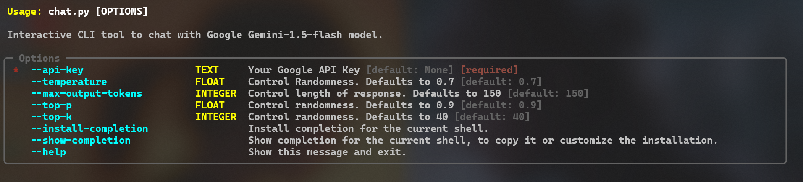

## Command Line Chat Bot using Google Gemini API in Python

# Introduction
This is a simple command line chat bot that uses the Google Gemini API to generate responses to user input. The chat bot is written in Python Use the `google-genrativeai` package to interact with the Google Gemini API.
If you want to know more about the Google Gemini API, you can check out the official documentation [here](https://g.co/gemini).

# Features
- Interactive chat with Google's generative AI models.
- Customizable parameters for response control:
  - `temperature`
  - `max-output-tokens`
  - `top-p`
  - `top-k`
- Easy-to-use CLI with `typer` for command-line options.

# Help Command


# Installation
1. Clone the repository:
    ```bash
        git clone https://github.com/Amul-Thantharate/CommandLine-Chat-Bot.git
        cd google-gemini-chatbot
    ```
2. Install the required dependencies:
    ```bash
    pip install -r requirements.txt
    ```
3. Run the chat bot:
    ```bash
    python chat.py --api-key <API_KEY>
    ```
4. Ask the chat bot a question and it will generate a response using the Google Gemini API.
 
# Usage
When running the chat bot, you can customize the parameters such as `temperature`, `max-output-tokens`, `top-p`, and `top-k`. The default values are:
- `temperature`: 0.5
- `top-p`: 0.9
- `top-k`: 40
- `max-output-tokens`: 100

Example:
```bash
python chat.py --api-key <API_KEY> --temperature 0.7 --top-p 0.8 --top-k 50 --max-output-tokens 150
```
# Conclusion
This command line chat bot uses the Google Gemini API to generate responses to user input. Written in Python, it utilizes the google-generativeai package for API interaction. Feel free to use it for generating responses and having conversations. If you have any questions or feedback, feel free to reach out. Thank you for using this chat bot!

# Author
- Amul Thantharate
- LinkedIn: [Amul Thantharate](https://www.linkedin.com/in/amul-thantharate/)
- GitHub: [Amul Thantharate](https://www.github.com/Amul-Thantharate)
